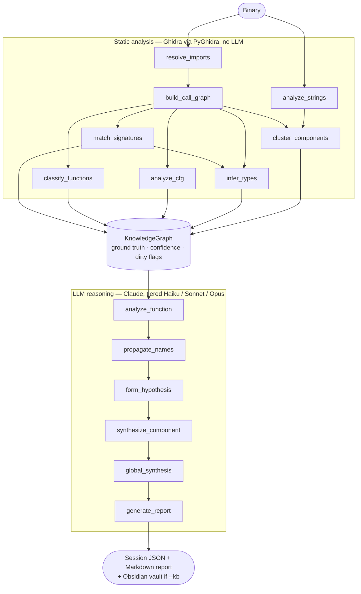

# REeve

REeve is an AI-powered binary reverse engineering assistant. You give it a binary and a goal. It gives you named functions, identified vulnerabilities, testable hypotheses, an Obsidian knowledge base, and a structured report.

## Two-Layer Pipeline

REeve separates concerns between Ghidra and Claude:

This is the actual task DAG the planner builds for a default (`"full analysis"`) goal:

Static analysis runs first and produces verified facts. The LLM only sees what Ghidra confirmed. There are no hallucinated function names or addresses.

## What REeve Produces

For a 76-function CTF heap-exploitation binary, a full run takes under 2 minutes and costs under $0.05:

- **75 named functions** with human-readable names and decompilation
- **2 components** (allocator subsystem, UI layer) with purpose descriptions
- **2 hypotheses** (tcache poisoning, UAF write primitive) with confidence scores
- **A structured report** covering purpose, vulnerability, exploitation path, and IOCs
- **55 Obsidian notes** with YAML frontmatter, wikilinks, and embedded decompilation

## When to Use REeve

REeve is useful when you have a binary and need to understand it quickly:

- CTF challenges with unknown binaries
- Malware triage before deep static analysis
- Finding the attack surface in a target binary
- Generating a starting knowledge base for a longer engagement

## When Not to Use REeve

REeve is not a decompiler and does not replace manual analysis. It builds a working model of the binary and generates hypotheses. Hypotheses require validation. The report is a starting point, not a ground truth.

For binaries with heavy obfuscation or packing, run an unpacker first. REeve works on what Ghidra can decompile.
